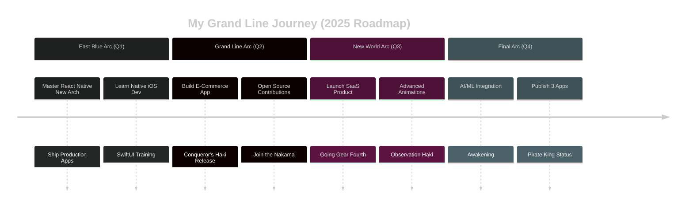

<div align="center">

<!-- Animated Header with Gradient -->


<br/>

<!-- Dynamic Typing Effect -->
<a href="https://git.io/typing-svg"></a>

<br/>

<!-- Social & Profile Stats -->
<p>
  <a href="https://github.com/ABIMADHAN?tab=followers">
    </a>
  <a href="https://github.com/ABIMADHAN?tab=repositories&sort=stargazers">
    </a>
  <a href="https://github.com/ABIMADHAN">
    </a>
</p>

<!-- Epic Anime Coding GIF -->


</div>

---

## 🎌 About This Developer (Profile Card Style)

<div align="center">

```
╔══════════════════════════════════════════════════════════════╗
║                                                              ║
║   🏴‍☠️ NAME: Madhan G                                          ║
║   ⚛️  CLASS: React Native Developer                         ║
║   🎌 TITLE: Code Pirate | Anime Connoisseur                 ║
║   📍 GUILD: Karur, Tamil Nadu, India                        ║
║   🌊 CURRENT ARC: Building Mobile Apps                      ║
║                                                              ║
║   ═══════════════ STATS ═══════════════                     ║
║   💪 POWER LEVEL: Over 9000!                                ║
║   ⚡ CODING: ████████░░ Lv. 85                              ║
║   🎯 DEBUGGING: ██████████ Lv. 99                           ║
║   🎨 UI/UX: ████████░░ Lv. 80                               ║
║   🍜 RAMEN CONSUMED: ∞                                       ║
║                                                              ║
╚══════════════════════════════════════════════════════════════╝
```

</div>


### 🏴‍☠️ The Journey Begins...

```typescript
interface Developer {
  name: string;
  role: string;
  location: string;
  currentAnime: string[];
  favoriteAnime: string[];
  codingStyle: string;
  dreamProject: string;
}

const ABIMADHAN: Developer = {
  name: "Madhan G",
  role: "React Native Developer ⚛️",
  location: "Karur, Tamil Nadu, India 🇮🇳",
  
  currentAnime: [
    "🏴‍☠️ One Piece (Current Arc: Egghead)",
    "⚔️ Demon Slayer: Infinity Castle",
    "🔥 Jujutsu Kaisen Season 2"
  ],
  
  favoriteAnime: [
    "One Piece 🏴‍☠️ (Luffy's determination = My code)",
    "Attack on Titan ⚔️ (Eren's resolve = My debugging)",
    "My Hero Academia 💥 (Plus Ultra = My workflow)",
    "Naruto 🍥 (Never give up = My motto)",
    "Death Note 📓 (Strategic thinking)",
    "Steins;Gate ⏰ (Time management)"
  ],
  
  codingStyle: "Gomu Gomu no... CODE! 🏴‍☠️",
  dreamProject: "Build an anime streaming app someday! 🎌"
};

console.log("I'm gonna be the King of Developers! 👑");
```

<br clear="right"/>

### 💭 Developer's Creed

> *"I won't run away anymore... I won't go back on my word... 
> That is my developer way!"* - Inspired by Naruto 🍥

- 🔭 Currently building **Cross-Platform Mobile Apps**
- 🎌 Watching **One Piece** (Episode 1000+) while coding
- 🌱 Learning **React Native New Architecture** (Plus Ultra!)
- 👯 Looking to collaborate on **Anime-related Open Source Projects**
- 💬 Ask me about **React Native, TypeScript, or One Piece theories**
- 📫 Reach me: **madhang.dev@gmail.com**
- ⚡ Fun fact: **I code with One Piece OST playing in background!** 🎵
- 🎯 Goal: **Build 3 apps in 2025 (like collecting Devil Fruits!)**

<br/>

<div align="center">
  
</div>

<br/>

## 🎴 Jutsu Arsenal (Tech Stack)

<div align="center">

### 📱 Mobile Development Techniques


### 🎨 Design Alchemy


### ⚔️ Backend Swordsmanship


### 🔮 State Management Magic


### 🛡️ Testing & Quality Armor


### 🚀 Deployment Haki


### 💻 Training Grounds


</div>

<br/>

<div align="center">
  
</div>

<br/>

## 📊 Power Level Stats

<div align="center">

```
┌─────────────────────────────────────────────────────────┐
│                    POWER LEVEL ANALYSIS                 │
├─────────────────────────────────────────────────────────┤
│  Coding Speed:        ████████████████████░  95%       │
│  Bug Fixing:          ███████████████████░░  90%       │
│  UI Design:           ████████████████░░░░░  80%       │
│  Problem Solving:     ██████████████████░░░  85%       │
│  Anime Knowledge:     ██████████████████████ 100%      │
│  Coffee Consumption:  ████████████████████░  ∞         │
└─────────────────────────────────────────────────────────┘
```

<br/>

 
  


</div>

<div align="center">
  

  


</div>

<div align="center">
  


</div>

<div align="center">
  


</div>

<br/>

<div align="center">
  
</div>

<br/>

## 🏴‍☠️ Current Arc: 2025 Development Saga

<div align="center">



</div>

<br/>

<div align="center">

| 🎯 Quest | 📊 Progress | 🏆 Status | 🎌 Anime Parallel |
|----------|------------|----------|------------------|
| Master RN New Arch | ████░░░░░░ 40% | 🔄 Training | Learning New Jutsu 🍥 |
| Build Production Apps | ███░░░░░░░ 30% | ⚔️ Battle | Gathering Crew 🏴‍☠️ |
| Open Source Contribution | ██░░░░░░░░ 20% | 📝 Planning | Entering Tournament 🥋 |
| Native Development | █░░░░░░░░░ 10% | 🌱 Beginning | New Technique 💪 |
| App Store Launch | ░░░░░░░░░░ 0% | 📅 Q4 2025 | Final Boss Fight 👊 |

</div>

<br/>

<div align="center">
  
</div>

<br/>

## 💪 Special Moves (What I Do Best)

<div align="center">

<table>
<tr>
<td align="center" width="25%">
<br>

<br><br>
<h3>🏴‍☠️ Gomu Gomu no Code</h3>
<p><b>Cross-Platform Mobile Apps</b></p>
<p>Stretching one codebase to iOS & Android!</p>
<br>
</td>
<td align="center" width="25%">
<br>

<br><br>
<h3>🔥 Fire Style: UI Jutsu</h3>
<p><b>Beautiful Interfaces</b></p>
<p>Pixel-perfect designs with smooth animations!</p>
<br>
</td>
<td align="center" width="25%">
<br>

<br><br>
<h3>⚡ Thunder Breathing</h3>
<p><b>Lightning-Fast Performance</b></p>
<p>Apps running at 60 FPS like Zenitsu!</p>
<br>
</td>
<td align="center" width="25%">
<br>

<br><br>
<h3>🚀 Plus Ultra Deploy</h3>
<p><b>App Store Mastery</b></p>
<p>Going beyond with CI/CD!</p>
<br>
</td>
</tr>
</table>

</div>

<br/>

<div align="center">
  
</div>

<br/>

## 🎌 Favorite Anime Quotes That Drive My Code

<div align="center">

```
╔═══════════════════════════════════════════════════════════════╗
║                                                               ║
║  "I don't want to conquer anything. I just think the guy     ║
║   with the most freedom in this ocean is the Pirate King!"   ║
║                                        - Monkey D. Luffy 🏴‍☠️  ║
║                                                               ║
║  "If you don't take risks, you can't create a future!"       ║
║                                        - Monkey D. Luffy 🏴‍☠️  ║
║                                                               ║
║  "Hard work is worthless for those that don't believe in     ║
║   themselves."                                                ║
║                                        - Naruto Uzumaki 🍥    ║
║                                                               ║
║  "If you don't like your destiny, don't accept it.           ║
║   Instead, have the courage to change it."                   ║
║                                        - Naruto Uzumaki 🍥    ║
║                                                               ║
║  "A lesson without pain is meaningless. For you cannot       ║
║   gain anything without sacrificing something else."         ║
║                                  - Edward Elric ⚗️            ║
║                                                               ║
║  "The world isn't perfect. But it's there for us,            ║
║   doing the best it can."                                    ║
║                                  - Roy Mustang 🔥             ║
║                                                               ║
╚═══════════════════════════════════════════════════════════════╝
```

</div>

<br/>

<div align="center">
  
</div>

<br/>

## 💻 Secret Techniques (Code Examples)

<details>
<summary>🏴‍☠️ <b>Gomu Gomu no Animated Button!</b></summary>

```typescript
import React from 'react';
import { Pressable, Text, StyleSheet } from 'react-native';
import Animated, {
  useSharedValue,
  useAnimatedStyle,
  withSpring,
  withSequence,
} from 'react-native-reanimated';

interface PirateButtonProps {
  title: string;
  onPress: () => void;
}

// Stretchy button like Luffy's powers! 🏴‍☠️
const GomuGomuButton: React.FC<PirateButtonProps> = ({ title, onPress }) => {
  const scale = useSharedValue(1);

  const animatedStyle = useAnimatedStyle(() => ({
    transform: [{ scale: scale.value }],
  }));

  const handlePress = () => {
    // Gear Second activation! ⚡
    scale.value = withSequence(
      withSpring(0.9),
      withSpring(1.2),
      withSpring(1)
    );
    onPress();
  };

  return (
    <Pressable onPress={handlePress}>
      <Animated.View style={[styles.button, animatedStyle]}>
        <Text style={styles.text}>🏴‍☠️ {title}</Text>
      </Animated.View>
    </Pressable>
  );
};

const styles = StyleSheet.create({
  button: {
    backgroundColor: '#FF6B6B',
    paddingHorizontal: 32,
    paddingVertical: 16,
    borderRadius: 25,
    shadowColor: '#000',
    shadowOffset: { width: 0, height: 4 },
    shadowOpacity: 0.3,
    shadowRadius: 5,
    elevation: 8,
  },
  text: {
    color: '#fff',
    fontSize: 18,
    fontWeight: 'bold',
    textAlign: 'center',
  },
});

export default GomuGomuButton;
```

</details>

<details>
<summary>🍥 <b>Shadow Clone Hook - useMultiState!</b></summary>

```typescript
import { useState, useCallback } from 'react';

// Create multiple state clones like Naruto's Shadow Clone Jutsu! 🍥
export function useMultiState<T>(initialStates: Record<string, T>) {
  const [states, setStates] = useState(initialStates);

  const updateState = useCallback((key: string, value: T) => {
    setStates(prev => ({
      ...prev,
      [key]: value,
    }));
  }, []);

  const resetState = useCallback((key: string) => {
    setStates(prev => ({
      ...prev,
      [key]: initialStates[key],
    }));
  }, [initialStates]);

  const resetAll = useCallback(() => {
    setStates(initialStates);
  }, [initialStates]);

  return {
    states,
    updateState,
    resetState,
    resetAll,
  };
}

// Usage: Believe it! 
// const { states, updateState } = useMultiState({
//   clone1: 'Training',
//   clone2: 'Coding',
//   clone3: 'Watching Anime',
// });
```

</details>

<details>
<summary>⚡ <b>Thunder Breathing API Service!</b></summary>

```typescript
import axios, { AxiosInstance } from 'axios';

// Fast as Zenitsu's Thunder Breathing! ⚡
class ThunderAPI {
  private instance: AxiosInstance;
  private isFlashMode: boolean = false;

  constructor(baseURL: string) {
    this.instance = axios.create({
      baseURL,
      timeout: 10000,
      headers: {
        'Content-Type': 'application/json',
        'X-Powered-By': 'Thunder-Breathing',
      },
    });

    this.setupInterceptors();
  }

  // First Form: Thunderclap and Flash! ⚡
  private setupInterceptors(): void {
    this.instance.interceptors.request.use(
      (config) => {
        console.log('⚡ Thunder Breathing... First Form!');
        const token = this.getSwordToken();
        if (token) {
          config.headers.Authorization = `Bearer ${token}`;
        }
        return config;
      },
      (error) => {
        console.log('💥 Attack failed!');
        return Promise.reject(error);
      }
    );

    this.instance.interceptors.response.use(
      (response) => {
        console.log('✨ Perfect hit!');
        return response;
      },
      async (error) => {
        if (error.response?.status === 401) {
          console.log('🔄 Switching to Godspeed mode!');
          await this.godspeedMode();
        }
        return Promise.reject(error);
      }
    );
  }

  private getSwordToken(): string | null {
    // Retrieve Nichirin Blade (Token)
    return localStorage.getItem('thunder_token');
  }

  private async godspeedMode(): Promise<void> {
    // God Speed mode for token refresh!
    this.isFlashMode = true;
    // Implement token refresh
  }

  // Sixth Form: Rumble and Flash!
  public async get<T>(url: string): Promise<T> {
    const response = await this.instance.get(url);
    return response.data;
  }

  // Seventh Form: Honoikazuchi no Kami!
  public async post<T>(url: string, data: any): Promise<T> {
    const response = await this.instance.post(url, data);
    return response.data;
  }
}

export default new ThunderAPI('https://api.myawesomeapp.com');
```

</details>

<br/>

<div align="center">
  
</div>

<br/>

## 🌊 Connect With This Pirate Developer!

<div align="center">

### 💬 Join my crew! Let's sail the Grand Line of code together! 🏴‍☠️

<br/>

[](https://github.com/ABIMADHAN)
[](mailto:madhang.dev@gmail.com)
[](https://linkedin.com/in/madhan-g)
[](https://twitter.com/ABIMADHAN)
[](https://madhang.dev)
[](https://myanimelist.net/profile/ABIMADHAN)

<br/>

```typescript
const nakama = {
  captain: "Madhan G",
  ship: "Going Merry (Dev Edition)",
  location: "Karur, Tamil Nadu, India 🇮🇳",
  timezone: "IST (UTC+5:30)",
  
  lookingFor: [
    "💼 Full-time developer opportunities",
    "🤝 Freelance mobile app projects", 
    "🌟 Open source collaborations",
    "🎌 Fellow anime-loving developers",
    "🏴‍☠️ Nakama to build epic apps"
  ],
  
  responseTime: "Faster than Gear Second! ⚡",
  motto: "I'm gonna be the King of Developers! 👑"
};

console.log("🏴‍☠️ Set sail!");
```

<br/>


</div>

<br/>

<div align="center">
  
</div>

<br/>

## 🎵 Currently Vibing To...

<div align="center">

```
    ♪ ♫ ♪ ♫ ♪ ♫ ♪ ♫ ♪ ♫ ♪ ♫
  ┏(・o･)┛ ┗(・o･)┓ ┏(・o･)┛ ┗(・o･)┓
  
  🎧 Current Playlist:
  
  🏴‍☠️ "We Are!" - One Piece OP1
  🔥 "Gurenge" - Demon Slayer OP
  ⚡ "The Day" - My Hero Academia OP1
  🍥 "Silhouette" - Naruto Shippuden
  ⚔️ "Guren no Yumiya" - Attack on Titan
  
  🎵 Coding Mode: PLUS ULTRA! 💪
  
  ☕ Ramen: ████████░░ 80%
  💻 Focus:  ██████████ 100%
  🚀 Hype:   ██████████ OVER 9000!
  
  ┏(・o･)┛ ┗(・o･)┓ ┏(・o･)┛ ┗(・o･)┓
    ♪ ♫ ♪ ♫ ♪ ♫ ♪ ♫ ♪ ♫ ♪ ♫
```

### 🎮 When I'm Not Coding...

🏴‍☠️ **Watching One Piece** - Currently at episode 1000+ (Egghead Arc hype!)  
🍥 **Re-watching Naruto** - Because believe it never gets old!  
⚔️ **Catching up on seasonal anime** - Never miss a new episode!  
🎨 **Exploring anime art** - UI/UX inspiration from anime aesthetics  
🎯 **Discussing anime theories** - Plot twists are my debugging  
📚 **Reading manga** - When anime isn't enough!  
🎮 **Gaming** - Genshin Impact, Honkai Star Rail breaks  

</div>

<br/>

<div align="center">
  
</div>

<br/>

## 🏆 My Anime List Stats

<div align="center">

| 🎌 Category | 📊 Count | 🏅 Status |
|------------|----------|-----------|
| Anime Watched | 100+ | 🔥 Seasoned Otaku |
| One Piece Episodes | 1000+ | 🏴‍☠️ Pirate King Path |
| Favorite Genre | Shonen | ⚡ Plus Ultra! |
| Watching Style | Binge + Weekly | 📺 Never Miss |
| Manga Read | 50+ | 📚 Growing |

### 🎯 Top 5 Anime (All Time)

1. 🏴‍☠️ **One Piece** - The greatest adventure!
2. ⚔️ **Attack on Titan** - Masterpiece storytelling
3. 🍥 **Naruto** - Childhood memories & life lessons
4. 💥 **My Hero Academia** - Plus Ultra inspiration!
5. 🔥 **Demon Slayer** - Breathtaking animation

</div>

<br/>

<div align="center">
  
</div>

<br/>

## 💡 Today's Anime Wisdom

<div align="center">


<br/><br/>


</div>

<br/>

<div align="center">
  
</div>

<br/>

<div align="center">

## 📈 Developer Activity


</div>

<br/>

<div align="center">
  
</div>

<br/>

<div align="center">

### ⭐ Found something interesting? Star it like you're powering up a Spirit Bomb! ⭐


<!-- Footer Wave -->


---

<p>


</p>

**© 2025 Madhan G | React Native Developer 👨‍💻 | Anime Enthusiast 🎌 | Karur, Tamil Nadu, India 🇮🇳**

*"I'm gonna be the King of Developers!" - Madhan D. G* 🏴‍☠️

</div>

<!-- Easter Egg for fellow anime fans -->
<!--
  🎉 おめでとう! You found the secret Omake! 🎉
  
  Secret One Piece Theory:
  "The One Piece isn't treasure... it's the friends we made along the way!
   Just kidding, it's probably ancient code documentation." 😄
  
  Fun Fact: I've watched over 5000+ episodes of anime!
  That's more commits than my GitHub! 😅
  
  Keep coding, keep watching, keep believing!
  PLUS ULTRA! ⚡🏴‍☠️🍥
  
  - Madhan G (The Code Pirate)
-->
